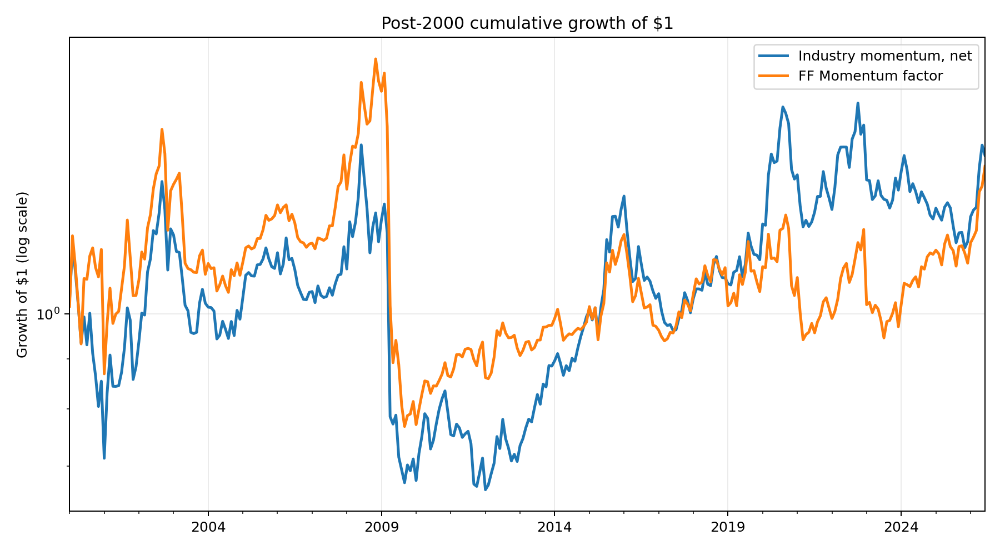
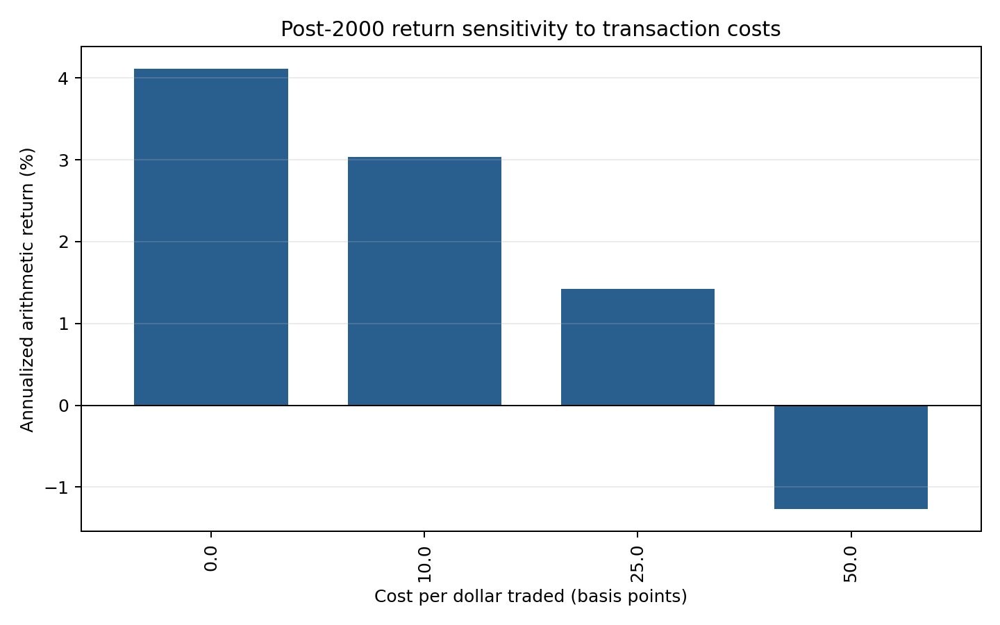

# Post-publication U.S. industry momentum

[](https://github.com/ToniettiPinhal/schonfeld-quant-research/actions/workflows/ci.yml)
[](https://www.python.org/)
[](LICENSE)

Does a fixed 12-2 momentum rule across 49 U.S. industries persist after its 1999
publication-era evidence, realistic temporal alignment, and turnover-based costs?

The honest answer from this implementation is: **only weakly**. From January 2000
through June 2026, the primary 10 bps specification earns a 3.04% annualized
arithmetic return with 17.68% volatility, a 0.17 Sharpe ratio, and a -55.54% maximum
drawdown. Its block-bootstrap Sharpe interval spans zero, and a four-factor regression
loads 0.88 on the standard Fama-French Momentum factor while leaving an annualized
intercept of -0.25% (Newey-West t = -0.13).

This is a research workflow, not a claim of new alpha.



## Research design

The primary specification was fixed before evaluating the locked test sample:

- data: monthly value-weighted returns for 49 Kenneth French U.S. industry portfolios;
- stable panel: July 1969 onward; first investable month July 1970;
- signal for month *t*: compounded returns from *t-12* through *t-2*;
- portfolio: equal-weight top 20% long and bottom 20% short;
- exposure: 100% long, 100% short, zero net;
- primary cost: 10 bps per dollar of absolute weight change;
- development: 1970-07 to 1984-12;
- validation: 1985-01 to 1999-12;
- locked test: 2000-01 to 2026-06.

Month-*t* weights never use month-*t* or month-*t-1* returns. A deterministic shock
test verifies that changing a current return cannot alter the current signal or any
earlier signal.

## Results at a glance

| Metric | Validation, net | Locked test, gross | Locked test, net |
|---|---:|---:|---:|
| Annualized arithmetic return | 10.55% | 4.11% | **3.04%** |
| Annualized volatility | 12.38% | 17.67% | **17.68%** |
| Annualized Sharpe | 0.85 | 0.23 | **0.17** |
| Maximum drawdown | -15.65% | -54.24% | **-55.54%** |
| HAC t-stat of monthly mean | 3.23 | 1.21 | **0.90** |
| Annualized traded notional | 10.32x | 10.77x | **10.77x** |

Further diagnostics make the result less impressive, not more:

- 95% moving-block interval for the test Sharpe: **[-0.19, 0.57]**;
- correlation with Fama-French Momentum in the test: **0.84**;
- regression R-squared on Mkt-RF, SMB, HML, and Mom: **0.72**;
- net annualized return at 25 bps: **1.42%**; at 50 bps: **-1.27%**;
- leave-one-industry-out test Sharpe range: **0.09 to 0.21**.

See the full [research note](reports/research_note.md),
[question-selection record](reports/research_question_selection.md), and generated
[result tables](reports/results/).



## Why the negative result matters

The pre-2000 validation Sharpe is 0.85, but the locked test Sharpe falls to 0.17.
Generic momentum exposure explains most of the post-2000 variation, and the strategy
experiences a severe momentum crash in April 2009. Reporting only the long historical
equity curve would therefore tell a materially misleading story.

The project treats a failed strong-alpha hypothesis as valid research evidence:
temporal alignment, costs, uncertainty, factor attribution, and falsification take
priority over an attractive backtest.

## Reproduce the study

```bash
python -m venv .venv
source .venv/bin/activate
python -m pip install --upgrade pip
python -m pip install -e .
python -m unittest discover -s tests -v
python scripts/run_research.py
```

On Windows PowerShell, activate with `.venv\Scripts\Activate.ps1`.

The run downloads official ZIP archives into the Git-ignored `data/raw/` directory,
executes the complete robustness analysis, and regenerates all committed tables,
figures, metadata, and the research note. Source URLs and SHA-256 checksums for the
CRSP 202606 vintage are recorded in `reports/run_metadata.json`.

Kenneth French's Data Library warns that reconstructed histories can be revised. A
future run on different checksums is a replication with a newer data vintage; it may
not reproduce every committed number exactly.

## Repository map

```text
.
├── data/                    # data policy; downloaded archives are ignored
├── notebooks/               # thin exploratory walkthroughs
├── reports/
│   ├── figures/             # generated diagnostics
│   ├── results/             # full non-cherry-picked tables
│   ├── research_note.md
│   └── research_question_selection.md
├── scripts/run_research.py  # end-to-end entry point
├── src/industry_momentum/
│   ├── data.py              # download, checksum, and parsing
│   ├── features.py          # lagged signals and portfolio formation
│   ├── backtest.py          # PnL, turnover, and costs
│   ├── metrics.py           # performance, HAC, and block bootstrap
│   ├── validation.py        # splits, robustness, attribution
│   └── analysis.py          # generated artifacts
└── tests/                   # alignment, accounting, parsing, and inference tests
```

## Scope and limitations

The industry portfolios are academic constructs, not directly tradable instruments.
The model omits borrow fees, financing spreads, market impact, taxes, capacity,
short availability, and investable-product tracking error. The cost grid is a
sensitivity analysis, not proof of implementability. Results cover one U.S. industry
taxonomy and do not establish international generality.

Nothing here is investment advice.

## Sources

- [Kenneth R. French Data Library](https://mba.tuck.dartmouth.edu/pages/faculty/ken.french/data_library.html)
- [49 Industry Portfolios construction](https://mba.tuck.dartmouth.edu/pages/faculty/ken.french/Data_Library/det_49_ind_port.html)
- [Momentum factor construction](https://mba.tuck.dartmouth.edu/pages/faculty/ken.french/data_library/det_mom_factor.html)
- [Moskowitz and Grinblatt (1999), *Do Industries Explain Momentum?*](https://doi.org/10.1111/0022-1082.00146)
- [Newey and West (1987), HAC covariance](https://doi.org/10.2307/1913610)

## License

Project code is released under the [MIT License](LICENSE). Downloaded third-party data
are not redistributed and remain subject to their owners' terms and copyright.
